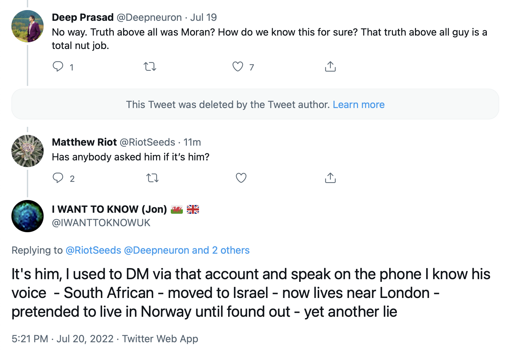

 

***Heatmap shows succession of activity between four accounts operated by Moran Lerner, from July 2020 to July 2022.***

Moran Lerner, a UK man identified by the BBC in 2016 as the [CEO of tech startup Chirp](https://www.bbc.com/news/technology-37585249), has been deceiving a small Twitter community dedicated to discussing UFOs for the past two years. Using at least four different account names, Mr. Lerner has purported to be:

1. **@truthbearer20** (main page not archived), a researcher who claimed to know the truth about aliens and secret anti-gravity technology, but said that the current UFO flap was based on a [*"threat narrative"*](https://web.archive.org/web/20200818220637/https://twitter.com/truthbearer20/status/1295844412212293636) to archieve some nefarious aim. 

2. [**@TruthOfTerAvaya**](https://web.archive.org/web/20211017043347/https://twitter.com/TruthofTerAvaya), a continuation of the **@truthbearer20** account using the name "Truth Above All", who claimed to have been in the UFO field [*"since before most of the more senior people in it were born"*](https://web.archive.org/web/20210903075018/https://twitter.com/TruthofTerAvaya/status/1433698616850489344). Truth Above All also claimed to have seen [*"the very first original full versions"*](https://web.archive.org/web/20210903065349/https://twitter.com/TruthofTerAvaya/status/1433684619518431244) of the Navy UAP videos released in 2017, and that Luis Elizondo, Jeremy Corbell, and Christopher Mellon digitally altered the videos. Like **@truthbearer20**, Truth Above All claimed knowledge of the reality of alien visitation.

3. [**@LipmanTroy**](https://web.archive.org/web/20220420044423/https://twitter.com/lipmantroy), a claimed Israeli-American veteran of the Six-Day war (see DMs to me, below), and US military intelligence insider with personal knowledge of the fraudulent nature of recent UFO claims. The acount was registered in October 2021, and is still in existence as of this time.

4. Finally, Mr. Lerner registered an account under his own name in April 2022, ([**@MoranLerner**](https://web.archive.org/web/20220609104750/https://twitter.com/moranlerner)). While the stories have become more grounded in his own biography, he continues to make similar claims of insider knowledge of the truth behind UFO claims, among other things.

The heatmap above contains four rows representing Mr. Lerner's four accounts, from top to bottom: **@truthbearer20**, **@TruthOfTerAvaya**, **@LipmanTroy**, and **@MoranLerner**. It shows the frequency of posts per day on those accounts, from July 2020 when **@truthbearer20** began posting, to July 2022. The first two accounts are now deleted, but their Tweets have been archived. As the heatmap shows, Mr. Lerner quickly transitions from one account to the next after deciding to adopt a new persona. This data, created using the timestamps of Tweets taken from the Internet Archive in the case of **@truthbearer20** and **@TruthOfTerAvaya**, and from live account data in the case of **@LipmanTroy** and **@MoranLerner**, confirms that the four accounts were controlled by one individual.

Beginning in July 2020 Mr. Lerner began Tweeting under **@truthbearer20**, changing the username of that same account to **@TruthOfTerAvaya** around February 2021, deleting **@TruthOfTerAvaya** on October 21, 2021 and immediately registering **@LipmanTroy**, and then transitioning to **@MoranLerner** in April-May 2022. Operating just one of these accounts appears to be more or less a full time job for Mr. Lerner, so it is not clear if he maintained any others during the past two years (There are some indications of other, prior or secondary accounts maintained by Mr. Lerner, but I will not discuss these in the initial version of this post).

[https://twitter.com/moranlerner/status/1549860781646385153](https://web.archive.org/web/20220729000748/https://twitter.com/moranlerner/status/1549860781646385153)

In response to some Twitter users correctly identifying him as the person behind some of these accounts, Mr. Lerner claimed that he is being targeted by *"highly disgruntled and extremist diehard believers and activists"*. 

I am none of those things. I am [skeptical](https://twitter.com/bradjohansson21/status/1551981712757899264) (and often [highly](https://twitter.com/bradjohansson21/status/1493198883018752003) [critical](https://twitter.com/bradjohansson21/status/1496268218893324296)) of claims that UFOs represent aliens or any unknown, highly advanced technology. I have also had many positive interactions with Mr. Lerner's accounts, including over Direct Messages, of which Mr. Lerner is a prolific sender. But I have also been paying attention to the changing stories, and to the common threads. I am not the only one. And regardless of one's opinions about UFOs, deception and manipulation should have no place in the discussion. 

This is not about "skeptics" versus "believers". Nor is it about being anonymous online - I am using an alias myself. It is about ensuring members of an online community are informed about this deception and have the context with which to evaluate Mr. Lerner's claims and behaviour. This is not a doxxing, nor do I condone anyone harassing Mr. Lerner or anyone connected to him. 

Possibly because of the impersonation he claimed to me in the DMs above, Mr. Lerner decided to begin using his name on Twitter instead of continuing his most recent fabricated persona, Troy Lipman, or creating another fake story. In doing so, he has opened himself to criticism of his past lies.

[https://twitter.com/moranlerner/status/1535713535954657287](https://web.archive.org/web/20220611200056/https://twitter.com/moranlerner/status/1535713535954657287)

Mr. Lerner denied that he was also Troy Lipman in a June 11, 2022 reply to **@InvNightSchool**, saying, *"Oh ffs. No mate. I’m not Troy😂. But on that one I actually take it as a compliment so cheers for that👍🏻"*. When I asked Mr. Lerner on July 29, 2022 to confirm whether he operated the above Twitter accounts, he responded, *"I know who owns those accounts, sure"*, and said that *"Troy is someone else [from* **@TruthOfTerAvaya** *and* **@truthbearer20**] *entirely"*.

## @MoranLerner <- @LipmanTroy

[https://twitter.com/moranlerner/status/1531740002551463936](https://web.archive.org/web/20220531205148/https://twitter.com/moranlerner/status/1531740002551463936)

It became obvious that **@MoranLerner** was **@LipmanTroy** soon after the former was registered and activity was transitioned away from the latter (see heatmap above showing the succession of activity on Mr. Lerner's accounts). **@MoranLerner** was registered in April 2022, and roughly a month after his first post was inexplicably praising Troy Lipman as being *"knowledgeable as fuck and very well connected with what’s happening in the States... he’s brilliant"*. As I show below, **@LipmanTroy** was not well-connected to anything, but lying and doing so to the point of not being able to keep his story straight.

[https://twitter.com/moranlerner/status/1521820723752353796](https://web.archive.org/web/20220729000901/https://twitter.com/moranlerner/status/1521820723752353796)

In a choreographed manner, **@MoranLerner** also asked for follower recommendations, which he received from **@LipmanTroy**. Once his followers were transitioned from **@LipmanTroy** to **@MoranLerner**, Mr. Lerner stopped posting on **@LipmanTroy** and began to use **@MoranLerner** full time. As of the time of writing, **@LipmanTroy**'s last post was June 5, 2022. During the first month of the **@MoranLerner** account, [that account and **@LipmanTroy** occasionally interacted](https://web.archive.org/web/20220526192531/https://twitter.com/LipmanTroy/status/1529906424410689540), referring vaguely to the same information that each of them seemed to know but would not spell out, in typical fashion.

[https://twitter.com/lipmantroy/status/1529906424410689540](https://web.archive.org/web/20220526192531/https://twitter.com/lipmantroy/status/1529906424410689540)

One reason for the abandonment of **@LipmanTroy** following Mr. Lerner registering an account under his own name may be the considerable time commitment involved. Between April 26, 2022, and July 20, 2022, **@MoranLerner** Tweeted 3,184 times, roughly 37 Tweets per day, on top of what is known to be a prolific DM output.

**@LipmanTroy** and **@MoranLerner** also shared Twitter activity patterns, both tending to Tweet at times appropriate for Western Europe, not for the Eastern United States, where **@LipmanTroy** claimed to live. However, in a July 29, 2022 DM to me, **@MoranLerner** likewise said that **@LipmanTroy** (whose true identity he claimed to know) lives in the United States.

## @LipmanTroy <- @TruthOfTerAvaya

[https://twitter.com/lipmantroy/status/1451289173302947845](https://web.archive.org/web/20211021204811/https://twitter.com/LipmanTroy/status/1451289173302947845)

The "Truth Above All" **@TruthOfTerAvaya** account was closed on October 21, 2021. **@LipmanTroy** was registered the same day, with a characteristic greyscale profile picture such as have been used for all of Mr. Lerner's accounts to date. Within hours of registering **@LipmanTroy**, the account made contact with **@PurelyYonatan**, a user that [frequently engaged with **@truthbearer20** and **@TruthOfTerAvaya**](https://web.archive.org/web/20210203182622/https://twitter.com/TruthofTerAvaya/status/1357032576473583622), and who was also [contacted by **@MoranLerner** after that account was registered](https://web.archive.org/web/20220729000528/https://twitter.com/moranlerner/status/1519774229402726403).

In a November 26, 2021 message to me, **@LipmanTroy** said, *"You knew my grandfather on here. He spoke very highly of you before he left"*. Realizing he was referring to **@TruthOfTerAvaya**, I thanked him and replied, *"I am sure I know who you are referring to"*, to which **@LipmanTroy** said *"I think you do"*.

I did not take this literally to mean that **@TruthOfTerAvaya** was run by **@LipmanTroy**'s grandfather, as this proposition seemed unlikely, but as **@LipmanTroy**'s way of telling me that Truth Above All was still around. You may ask how I know that **@LipmanTroy** was referring to **@TruthOfTerAvaya**: there was absolutely no one else to whom he could have been referring, and not long after **@TruthOfTerAvaya** disappeared and **@LipmanTroy** was registered, the latter began to DM me with similar regularity to the former.

## Moran Lerner = @TruthOfTerAvaya

[https://twitter.com/TruthofTerAvaya/status/1397469034732474371](https://web.archive.org/web/20210526082615/https://twitter.com/TruthofTerAvaya/status/1397469034732474371)

Although Mr. Lerner's subsequent accounts made similar comments, the **@TruthOfTerAvaya**/**@truthbearer20** persona was notable for its prominent claiming of direct knowledge of alien/non-human intelligence and its presence on Earth. On this basis, these personas engaged with Twitter users who were intrigued about these claims, frequently offering to DM those who had questions. One such individual, Jon (**@IWANTTOKNOWUK**) had extensive interaction with the **@truthbearer20** persona, including phone conversations. In a July 20, 2022 Tweet, [**@IWANTTOKNOWUK** said that the voice on the other end was that of Moran Lerner](https://web.archive.org/web/20220720172201/https://twitter.com/IWANTTOKNOWUK/status/1549806662134923266).

[https://twitter.com/IWANTTOKNOWUK/status/1549806662134923266](https://web.archive.org/web/20211127035442/https://twitter.com/IWANTTOKNOWUK/status/1549806662134923266)

Mr. Lerner's voice can be heard on episodes of the [*Strange Recon* podcast](https://www.youtube.com/watch?v=akJkQZlzBOc), and features a distinctive mixed accent, with heavy South African undertones. Elsewhere, Mr. Lerner listed the University of South Africa as one of his alma maters.

In a DM to me on July 29, 2022 Mr. Lerner confirmed that he spoke to Jon (**@IWANTTOKNOWUK**) on the phone, as claimed in the Tweet above. Mr. Lerner also said that Jon is the origin of claims that he was **@LipmanTroy** and **@TruthOfTerAvaya**/**@truthbearer20**, and that he was introduced to Jon by the person behind the two accounts.

It is worth noting here that Jon (**@IWANTTOKNOWUK**) is not the origin of the realization that **@MoranLerner**, **@LipmanTroy**, and **@TruthOfTerAvaya**/**@truthbearer20** are the same person. I came to that conclusion independently, and found out within the past 2 months that a small handful of others determined the same thing.

## Lies upon lies

If **@MoranLerner** is **@LipmanTroy**, and **@LipmanTroy** is **@TruthOfTerAvay** and **@truthbearer20**, then all of these Twitter accounts and personas belong to and have been operated by Mr. Lerner. It means that at least some of the various contradictory and improbable claims made by Mr. Lerner are lies.

[https://twitter.com/lipmantroy/status/1529906424410689540](https://web.archive.org/web/20211127035641/https://twitter.com/LipmanTroy/status/1464167668492156930)

Some claims are contradictory in and of themselves, irrespective of establishing that Mr. Lerner operated all of the above accounts. While **@LipmanTroy** informed me that **@TruthOfTerAvaya** was his grandfather, he also claimed to have grown children *"in high military, intelligence and scientific positions"*.

In DMs to me, **@LipmanTroy** also claimed to be an Israeli-born veteran of the 1967 Six-Day War between Israel and a coalition of neighbouring states. Assuming a conscription age of 17 in 1967, **@LipmanTroy** would be 72 this year, making it impossible for his grandfather to have been posting on Twitter in 2021 (without access to a time machine). As **@LipmanTroy** also told me he was in the Israeli Defense Forces (IDF) in 1964, that would make him at least 75 this year. **@LipmanTroy** shared photos with me of an individual in the IDF from 1964 to 1975, which he claimed was himself, and which I will not post here for want of not exposing the identity of an unsuspecting person. Needless to say, the grandfather of a 75-year-old man was not posting on Twitter. **@LipmanTroy** told me he served for 22 years in *"the IDF and MID, then served another 30+ years in the US where I’ve resided as a citizen since 1988"*.

[https://twitter.com/LipmanTroy/status/1458895199552352266](https://web.archive.org/web/20211111203144/https://twitter.com/LipmanTroy/status/1458895199552352266)

It is useful to understand where the controversy over **@LipmanTroy**'s nationality first arose. Marik Von Rennenkampff, a columnist for the online political newsletter *The Hill*, pointed out **@LipmanTroy**'s distinctive British spelling, grammar and phrasings, used while describing military matters from the perspective of a US citizen. The Tweets highlighted by Mr. Von Rennenkampff (**@mvonren**) also included **@LipmanTroy** claiming that his family goes back 5 generations *"in the defence industry"* in the United States, which contradicts **@LipmanTroy**'s later claims to me that a) he never claimed to be American, and b) he became a United States citizen in 1988. There are many more such examples of Mr. Lerner, as **@LipmanTroy**, contradicting himself and being unable to keep his story straight.

[https://twitter.com/MvonRen/status/1489076329764978693](https://web.archive.org/web/20220203032547/https://twitter.com/MvonRen/status/1489076329764978693)

It should also be said that those who naturalize to the United States often adopt US spelling and grammatical conventions (see: Mick West), and it would be doubly so for those involved in military and intelligence. What does explain **@LipmanTroy**'s British spelling and grammar is that he is not a US citizen and has no insider knowledge or connections to military and intelligence circles, but is in fact Moran Lerner, a British national who spends his time deceiving his small group of followers on Twitter. Despite this, **@LipmanTroy** made many references to his being American, but in a February 11, 2022 DM to me, **@LipmanTroy** said that he *"never claimed to be [American]"*.

[https://twitter.com/LipmanTroy/status/1462336034365190144](https://web.archive.org/web/20211121082430/https://twitter.com/LipmanTroy/status/1462336034365190144)

[https://twitter.com/LipmanTroy/status/1463465459756539904](https://web.archive.org/web/20211125001806/https://twitter.com/LipmanTroy/status/1463465459756539904)

Looking only at Mr. Lerner's latest account, **@MoranLerner**, the self-contradictory claims are still easy to find. While Mr. Lerner asserted in a June 8, 2022 Tweet that every UAP incident since 2003/2004 was part of war games conducted by [*"a classified US military branch made public in December 2019"*](https://web.archive.org/web/20220608211732/https://twitter.com/moranlerner/status/1534645697093443586), (this seems to refer to the United States Space Force, which was created in December 2019), in a [July 8 episode of the *Strange Recon* podcast](https://www.youtube.com/watch?v=1fwYLs0imGk), he put forward a completely different explanation for the 2004 Nimitz "Tic-Tac" incident.

<iframe width="560" height="315" src="https://www.youtube.com/embed/iLac80L0kFg" title="YouTube video player" frameborder="0" allow="accelerometer; autoplay; clipboard-write; encrypted-media; gyroscope; picture-in-picture" allowfullscreen></iframe>

Instead of a secretive wargame as said elsewhere, Mr. Lerner suggested here that Navy pilot David Fravor, against his orders, flew into an active missile range, whereupon a missile operator located in a submarine spontaneously took manual control of a guided missile and used it to follow Fravor's plane to his CAP point (see https://www.youtube.com/watch?v=9zenIR71XM4 for the full original video). And as evidence-free or implausible as either claim is, they are also, like much of what Mr. Lerner says, contradictory and incompatible.

While I do not wish to delve into Mr. Lerner's personal biography - the purpose of this information is not and should not be doxxing or revealing personal information that an individual does not want to reveal - there are indications that he is not being truthful about his professional background. Mr. Lerner has uploaded CVs a [variety](https://www.topionetworks.com/people/moran-lerner-5ad9d88278e0025a5b5a80b3) of [business](https://data-lead.com/person/name/Moran+Lerner/id/24552329/v/28e23) and employment websites, some of which contain contradictory information about his educational background. Mr. Lerner variously claims degrees from the University of California, Berkeley in [Artificial Intelligence, Cyber Psychology](https://www.topionetworks.com/people/moran-lerner-5ad9d88278e0025a5b5a80b3), and [Consumer Psychology](https://graduates.name/university_of_california_berkeley-7940-41#id53743189).

On one site, Mr. Lerner claims a [Master of Science (B.S.) from Berkeley (2000-2002)](https://graduates.name/university_of_california_berkeley-7940-41#id53743189). However, the University of California, Berkeley **does not offer a Master of Science (M.S.) degree in psychology**: [*"The Psychology Department does not offer a terminal master’s degree program. However, doctoral students in the Department of Psychology may opt to pursue a Master of Arts degree en route to the doctoral degree."*](https://web.archive.org/web/20210125012904/https://psychology.berkeley.edu/students/graduate-program/degree-requirements-optional-master-arts-degree).

Mr. Lerner's claimed degree from the University of South Africa is also given variously as being from [1995-1998](https://radaris.co.uk/p/Moran/Lerner/) and [1994-2000](https://graduates.name/university_of_california_berkeley-7940-41#id53743189), and being in [Psychology, Business Marketing, Social Anthropology](https://radaris.co.uk/p/Moran/Lerner/), [Cognitive Psychology](https://www.topionetworks.com/people/moran-lerner-5ad9d88278e0025a5b5a80b3), and [Behavioural and Cognitive Psychology](https://graduates.name/university_of_california_berkeley-7940-41#id53743189) on different sites. These appear to be self-service pages akin to LinkedIn, added by Mr. Lerner or someone else, and not generated algorithmically.

Besides various false and contradictory biographical statements, Mr. Lerner's lies fall into four main categories:

1. Claiming status and expertise in a given field, or personal relationships with important individuals.
2. Claiming unique knowledge of or belief in the realities of alien visitation.
3. Claiming knowledge of the truth behind the current UFO flap in the United States, often framed as a conspiracy or psy-op.

In the sections below, I will present representative examples of these from all of the accounts known to belong to Mr. Lerner. The only barrier to providing many more examples of these lies is time, and not wanting an unreadably long article, as they are voluminous. Needless to say, not all of what Mr. Lerner's accounts claim can be true, and more likely none of it is. I have more than 10,000 Tweets from the **@truthbearer20** and **@TruthOfTerAvaya** account saved, which I may make available on this post in bulk at a later date. Should **@LipmanTroy** and **@MoranLerner** also be deactivated, the Tweets from those accounts have also been saved. None of the Tweets in the screenshots presented have been altered in any way, and each comes with a link to its respective [Internet Archive](https://archive.org) page.

### 1. Working with "people who are top of their game"

[https://twitter.com/truthbearer20/status/1283825827541639171](https://web.archive.org/web/20200716183632/https://twitter.com/truthbearer20/status/1283825827541639171)

[https://twitter.com/truthbearer20/status/1287097536281550848](https://web.archive.org/web/20200725192758/https://twitter.com/truthbearer20/status/1287097536281550848)

[https://twitter.com/truthbearer20/status/1308465471855955968](https://web.archive.org/web/20200922205251/https://twitter.com/truthbearer20/status/1308465471855955968)

[https://twitter.com/truthbearer20/status/1308763950876680195](https://web.archive.org/web/20200923172710/https://twitter.com/truthbearer20/status/1308763950876680195)

[https://twitter.com/truthbearer20/status/1336388413042397185](https://web.archive.org/web/20201208193933/https://twitter.com/truthbearer20/status/1336388413042397185)

[https://twitter.com/TruthofTerAvaya/status/1384487754218696707](https://web.archive.org/web/20210420124317/https://twitter.com/TruthofTerAvaya/status/13844877542186967)

[https://twitter.com/TruthofTerAvaya/status/1433698616850489344](https://web.archive.org/web/20210903075018/https://twitter.com/TruthofTerAvaya/status/1433698616850489344)

[https://twitter.com/TruthofTerAvaya/status/1447133356320333826](https://web.archive.org/web/20211010093424/https://twitter.com/TruthofTerAvaya/status/1447133356320333826)

[https://twitter.com/TruthofTerAvaya/status/1397469034732474371](https://web.archive.org/web/20210526082615/https://twitter.com/TruthofTerAvaya/status/1397469034732474371)

[https://twitter.com/LipmanTroy/status/1457073525819330562](https://web.archive.org/web/20211106205758/https://twitter.com/LipmanTroy/status/1457073525819330562)

[https://twitter.com/LipmanTroy/status/1482710377280507907](https://web.archive.org/web/20220116134947/https://twitter.com/LipmanTroy/status/1482710377280507907)

[https://twitter.com/LipmanTroy/status/1486810112090120192](https://web.archive.org/web/20220127212039/https://twitter.com/LipmanTroy/status/1486810112090120192)

[https://twitter.com/LipmanTroy/status/1452187749461676032](https://web.archive.org/web/20211024081845/https://twitter.com/LipmanTroy/status/1452187749461676032)

[https://twitter.com/LipmanTroy/status/1474667951206850570](https://web.archive.org/web/20211225091203/https://twitter.com/LipmanTroy/status/1474667951206850570)

[https://twitter.com/moranlerner/status/1548721461678018561](https://web.archive.org/web/20220717172951/https://twitter.com/moranlerner/status/1548721461678018561)

[https://twitter.com/moranlerner/status/1526225902954328065](https://web.archive.org/web/20220516154029/https://twitter.com/moranlerner/status/1526225902954328065)

[https://twitter.com/moranlerner/status/1528705114432757760](https://web.archive.org/web/20220523115152/https://twitter.com/moranlerner/status/1528705114432757760)

[https://twitter.com/moranlerner/status/1539519802041061376](https://web.archive.org/web/20220623013152/https://twitter.com/moranlerner/status/1539519802041061376)

[https://twitter.com/moranlerner/status/1549327630196957185](https://web.archive.org/web/20220719093918/https://twitter.com/moranlerner/status/1549327630196957185)

<iframe width="560" height="315" src="https://www.youtube.com/embed/Ig3SZBMd3TA" title="YouTube video player" frameborder="0" allow="accelerometer; autoplay; clipboard-write; encrypted-media; gyroscope; picture-in-picture" allowfullscreen></iframe>

In the clip above, from the *Josh & Artemis Show*, Mr. Lerner claims to personally know members of the United States Navy's Unifientied Aerial Phenomenon Task Force (UAPTF) (See https://www.youtube.com/watch?v=EtIvm1uMUjI for the full original video).

### 2. Aliens for me, not for thee

[https://twitter.com/truthbearer20/status/1296167196062883840](https://web.archive.org/web/20200819192914/https://twitter.com/truthbearer20/status/1296167196062883840)

[https://twitter.com/truthbearer20/status/1315432263379812353](https://web.archive.org/web/20201011232402/https://twitter.com/truthbearer20/status/1315432263379812353)

https://web.archive.org/web/20201206065142/https://twitter.com/truthbearer20/status/1334649211380502532

[https://twitter.com/TruthofTerAvaya/status/1413455431238782979](https://web.archive.org/web/20210709111211/twitter.com/TruthofTerAvaya/status/1413455431238782979)

[https://twitter.com/TruthofTerAvaya/status/1397527519222435840](https://web.archive.org/web/20210526121954/twitter.com/TruthofTerAvaya/status/1397527519222435840)

[https://twitter.com/TruthofTerAvaya/status/1397468628463898624](https://web.archive.org/web/20210526082456/https://twitter.com/TruthofTerAvaya/status/1397468628463898624)

[https://twitter.com/LipmanTroy/status/1462744794892062720](https://web.archive.org/web/20211122154557/https://twitter.com/LipmanTroy/status/1462744794892062720)

[https://twitter.com/LipmanTroy/status/1464167133659779125](https://web.archive.org/web/20211127035442/https://twitter.com/LipmanTroy/status/1464167133659779125)

[https://twitter.com/LipmanTroy/status/1464300817423425540](https://web.archive.org/web/20211127135405/https://twitter.com/LipmanTroy/status/1464300817423425540)

[https://twitter.com/moranlerner/status/1532283684606320640](https://web.archive.org/web/20220602085125/https://twitter.com/moranlerner/status/1532283684606320640)

[https://twitter.com/moranlerner/status/1547351609511972865](https://web.archive.org/web/20220729001049/https://twitter.com/moranlerner/status/1547351609511972865)

[https://twitter.com/moranlerner/status/1520042214780555266](https://web.archive.org/web/20220729001328/https://twitter.com/moranlerner/status/1520042214780555266)

[https://twitter.com/moranlerner/status/1531187791887011840](https://web.archive.org/web/20220530081710/https://twitter.com/moranlerner/status/1531187791887011840)

### 3. The truth about UFOs - that only one man knows

[https://twitter.com/truthbearer20/status/1295844412212293636](https://web.archive.org/web/20200818220637/https://twitter.com/truthbearer20/status/1295844412212293636)

[https://twitter.com/truthbearer20/status/1310473592224837632](https://web.archive.org/web/20200928082843/https://twitter.com/truthbearer20/status/1310473592224837632)

[https://twitter.com/TruthofTerAvaya/status/1433701386303197210](https://web.archive.org/web/20210903080030/https://twitter.com/TruthofTerAvaya/status/1433701386303197210)

[https://twitter.com/TruthofTerAvaya/status/1390792690430889987](https://web.archive.org/web/20210509015704/twitter.com/TruthofTerAvaya/status/1390792690430889987)

[https://twitter.com/TruthofTerAvaya/status/1421733794227408898](https://web.archive.org/web/20210801072605/https://twitter.com/TruthofTerAvaya/status/1421733794227408898)

[https://twitter.com/LipmanTroy/status/1456215101837557766](https://web.archive.org/web/20211104115517/https://twitter.com/LipmanTroy/status/1456215101837557766)

[https://twitter.com/LipmanTroy/status/1484799415680479232](https://web.archive.org/web/20220122081052/https://twitter.com/LipmanTroy/status/1484799415680479232)

[https://twitter.com/moranlerner/status/1552378967801450497](https://web.archive.org/web/20220727205524/https://twitter.com/moranlerner/status/1552378967801450497)

[https://twitter.com/moranlerner/status/1525050330332942336](https://web.archive.org/web/20220513094916/https://twitter.com/moranlerner/status/1525050330332942336)

[https://twitter.com/moranlerner/status/1529789683785519104](https://web.archive.org/web/20220526114141/https://twitter.com/moranlerner/status/1529789683785519104)

[https://twitter.com/moranlerner/status/1534645697093443586](https://web.archive.org/web/20220608211732/https://twitter.com/moranlerner/status/1534645697093443586)

## Why?

It is hard to say why Mr. Lerner has perpetrated this con. Is it just a LARP, carried out for the enjoyment of fooling a small group of admirers? Is Mr. Lerner a Walter Mitty-type character, who feels a compulsion to exaggerate his own importance, intelligence, and success? Has it all been a social experiment, perpetrated by an unemployed former psychology student with too much time on his hands?

Over the course of two years, Mr. Lerner has posed, at one time or another, as a UFO researcher, experiencer from birth, archaeologist, anti-gravity expert, Nazi-hunter, US military intelligence insider, aerospace consultant, and as someone close to US Space Command and the US Navy's UAP investigations, among other things. It is clear that some think Mr. Lerner has something important and unique to say. They deserve to know that most, and more likely all of it has been a lie, and that his word means nothing.

Mr. Lerner's deception brings to mind the [*A Gay Girl In Damascus* hoax](https://en.wikipedia.org/wiki/A_Gay_Girl_In_Damascus). The blog, written by an American man, Tom MacMaster, in the midst of the Syrian civil war, purported to be the voice of a marginalized Syrian woman. Rather than seeing his deception as harmful, the author said, *"I feel that I have created an important voice for issues that I feel strongly about"*. It is possible that Mr. Lerner has a similar, and similarly warped motivation: to lie for the purposes of convincing others of what he sees as the bogus nature of recent UFO claims.

But far from encouraging critical thinking about UFO claims, Mr. Lerner has substituted these for his own, sometimes equally, sometimes more outlandish claims. Ultimately, it is not about any message, just about Mr. Lerner and his fake insider knowledge. It is clear that some of Mr. Lerner's admirers were aware of his previous accounts, and if so should know that many of his claims have been untrue. They should ask themselves why the ends justify the means in his case, when they are rightly critical of other examples of this kind of reasoning.

*With files from Mark ([@hackthesim](https://twitter.com/hackthesim))*
